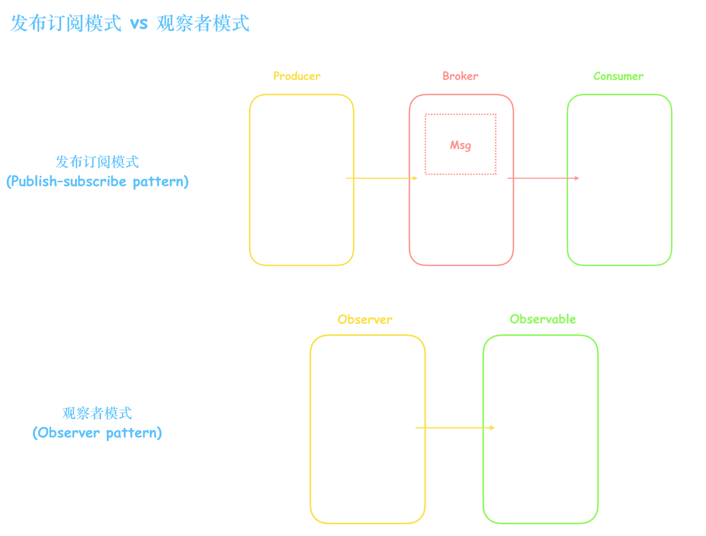

# 【设计模式】- 观察者模式

## 1、什么是观察者模式

观察者模式定义了**一对多**的关系，即一个发布者可以有多个订阅者，一个订阅者也可以订阅多个发布者。当发布者发送消息的时候，所有订阅者都会收到这个消息，这样实现了松耦合。

观察者模式和发布订阅模式很相似，但有着细微的差别，发布订阅模式有一个中间者来作为联通发布者和订阅者的桥梁，而观察者模式是发布者和订阅者直接通信。

我们实现的时候不过多考虑观察者模式和发布订阅模式的区别。

## 2、实现观察者模式

## 3、常见应用场景

## 4、常见问题

### 1、观察者模式和发布订阅模式区别
- 观察者模式：只有两个角色 —— 观察者 + 被观察者；是松耦合的关系；多用于单个应用内部。
- 发布订阅模式：不仅仅只有发布者和订阅者两个角色，还存在一个中间者；完全不存在耦合；更多用于跨应用的模式(cross-application pattern)，比如我们常用的消息中间件。

## 5、总结
