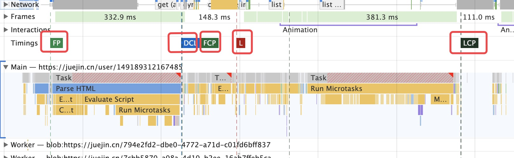

# 使用Chrome调试性能

## 加载时

### 1、导致加载慢的原因
#### 1.1、HTTP请求过多
`HTTP`请求在连接的过程中会经历`DNS`查询、三次握手、服务器处理发送响应、四次挥手等，所以发送过多的`HTTP`请求会导致性能慢。

**使用`Chrome`查看请求的过程：**

**如图所示：**

**逐个分析参数：**

1. `Queueing`：在队列中排队的时间，如果遇见优先级高的、`TCP`连接达到上限等情况
2. `Stalled`：Queueing中中止时间。 --从`TCP`连接完成到真正能够发送数据的时间--
3. `DNS`：`DNS`查找使用的时间
4. `Initial Connection`：建立连接使用的时间，包括三次握手🤝等
5. `SSL`：完成`SSL`握手🤝使用的时间
6. `Request sent`：发出网络请求所使用的时间
7. `Waiting`（`TTFB：Time To First Byte`）：页面从发出请求到收到响应消息第一个字节之间的时间，包含了`DNS`、`TCP`等时间。
8. `Content Download`：接收响应所使用的时间。

所以当请求过多的时候在`HTTP`连接的过程中会花费一定的时间，所以可以将一些小的文件合并成一个较大的文件📃，减少`HTTP`请求，常见的运用就是**雪碧图**。

**使用HTTP2.0**

1. 多路复用，`HTTP1.1`处理多个请求需要建立多个`TCP`连接🔗，`2.0`可以给请求用**流`ID`**作为唯一标识可以多个请求复用一个`TCP`连接。
2. 首部压缩，`HTTP2.0`在客户端和服务端使用“首部表”来跟踪存储之前`HTTP`请求的首部字段，并用键值对的方式存储起来；对于后续相同的首部字段直接使用首部表存储的就可以了。

| 索引 | 首部名称 | 值   |
| ---- | -------- | ---- |
| 62   | Header1  | foo  |
| 63   | Header2  | But  |
| 64   | Header3  | Bar  |

使用：`62 63 64`

#### 1.2、请求资源过大

在请求资源很大的时候浏览器的`Content Download`时间就会相应变长，所以如果涉及到的资源是首页显示还是建议拆分文件，让用户尽快的看见首页内容。

**如图所示：**

其中的`size`就是资源的大小。为了减少资源大小、加快请求速率可以进行如下操作：

1. 资源压缩，减少包体积提升网络传输的速率：使用`webpack`压缩公共资源，响应头配置`gzip`
2. 使用缓存，从上图可以看见有的资源是通过`memorize`以及`disk`获取的，对应的缓存分别放在内和磁盘中，当响应头有`ETag`时就会把资源存在磁盘中

**加载时的优化核心就是提高资源的加载速度。**

## 运行时

运行时主要涉及到浏览器的渲染过程以及`JavaScript`引擎的效率。

**浏览器渲染过程：**

**如图所示：**

需要注意的是如果解析过程遇到了`script`标签🏷会阻塞`HTML`的解析（`CSS`的加载和解析不会阻塞`HTML`解析但是会阻塞渲染）。

### performance分析：

`performance`可以记录页面加载时的性能分析以及录制⏺页面操作时的性能分析。

**如图所示：**

在`performance`面板可以使用 `W、A、S、D` 键调整您的选择。 `W` 和 `S` 分别代表放大和缩小。 `A` 和 `D` 分别代表左移和右移。

大概分为如下三部分：
**1、overview网格区域**
1. `FPS`，`FPS`记录📝的绿色线🧵越高`FPS`就越高，红色表示`FPS`低可能会出现卡针。
2. `CPU`，表示消耗`CPU`资源的事件类型，和统计结果区域的颜色-事件对应
3. `NET`，每一个横杠都表示一种资源的加载情况，横杠越长加载资源时间越长，横杠的浅色区域表示等待时间（接收到第一个字节到下载完成的时间）

**2、网格区域：**
统计了各个模块的细节：`NetWork`、`Main`、`GPU`等。`Main`表示主线程相关的信息（`Main`里面的任务也对应这统计区域的颜色-事件），如：`Parse HTML、Recalculate style`等。

其中有三个事件节点的虚线：

**如图所示：**

`FP`表示首次绘制的事件、`DCL`表示`DOMContentLoad`事件、`L`表示`onload`事件。选中某个事件后会在最下面👇的统计区域出现事件相关的信息。

**3、统计结果区域**

|颜色|说明|
| -- | -- |
|蓝色(Loading)|网络通信和HTML解析|
| 黄色(Scripting)|JavaScript执行|
|紫色(Rendering)|样式计算和布局，即重排|
|绿色(Painting)|重绘|
|灰色(system)|其它事件花费的时间|
|白色(Idle)|空闲时间|

通过统计分析可以得到那一部分消耗的时间比较长，我们可以对其进行相应的优化。

## performance API

使用`performance API`也可以检测到页面的性能情况。

可以通过`performance API`分析出如下时间：
- 白屏时间：从我们打开网站到有内容渲染出来的时间点。
- 首屏时间：首屏内容渲染完毕的时间节点。
- 用户可操作时间节点：`domready`触发节点。
- 总下载时间：`window.onload`的触发节点。

`performance API`主要包含以下几个属性：

**1、memory，内存情况**

- `jsHeapSizeLimit`：内存大小限制
- `totalJSHeapSize`：总的内存大小
- `usedJSHeapSize`：可使用的内存大小

如果`usedJSHeapSize`大于`totalJSHeapSize`那么可能会出现内存泄露的情况。

**2、navigation，页面来源信息**

- `redirectCount`，如果页面是重定向跳转的表示重定向跳转的次数
- `type`，页面的打开方式，在`__proto__`中可以查看`type`类型的枚举

**3、onresourcetimingbufferfull回调函数**

该回调函数会在浏览器的资源时间性能缓冲区满了的时候会执行的。

**4、timeOrigin，基准时间**

`performance API`中一系列时间的基准时间，精确到万分之一毫秒。

**5、timing，关键时间节点**

一系列的关键时间节点，包括网络请求、解析等时间。

**如图所示：**

